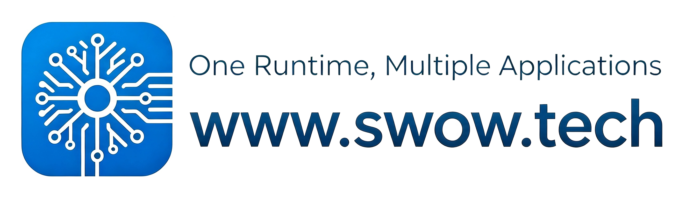
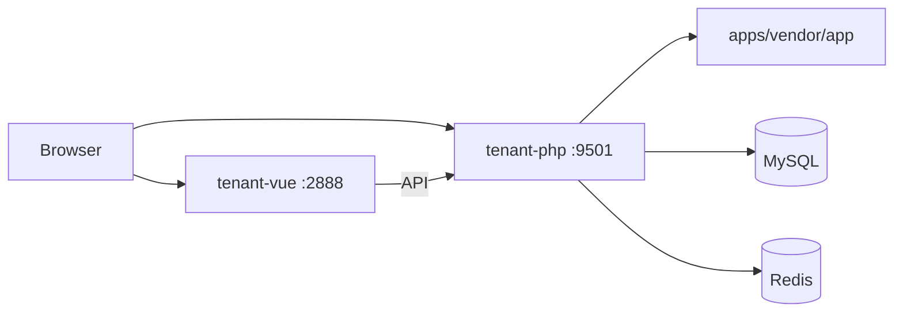
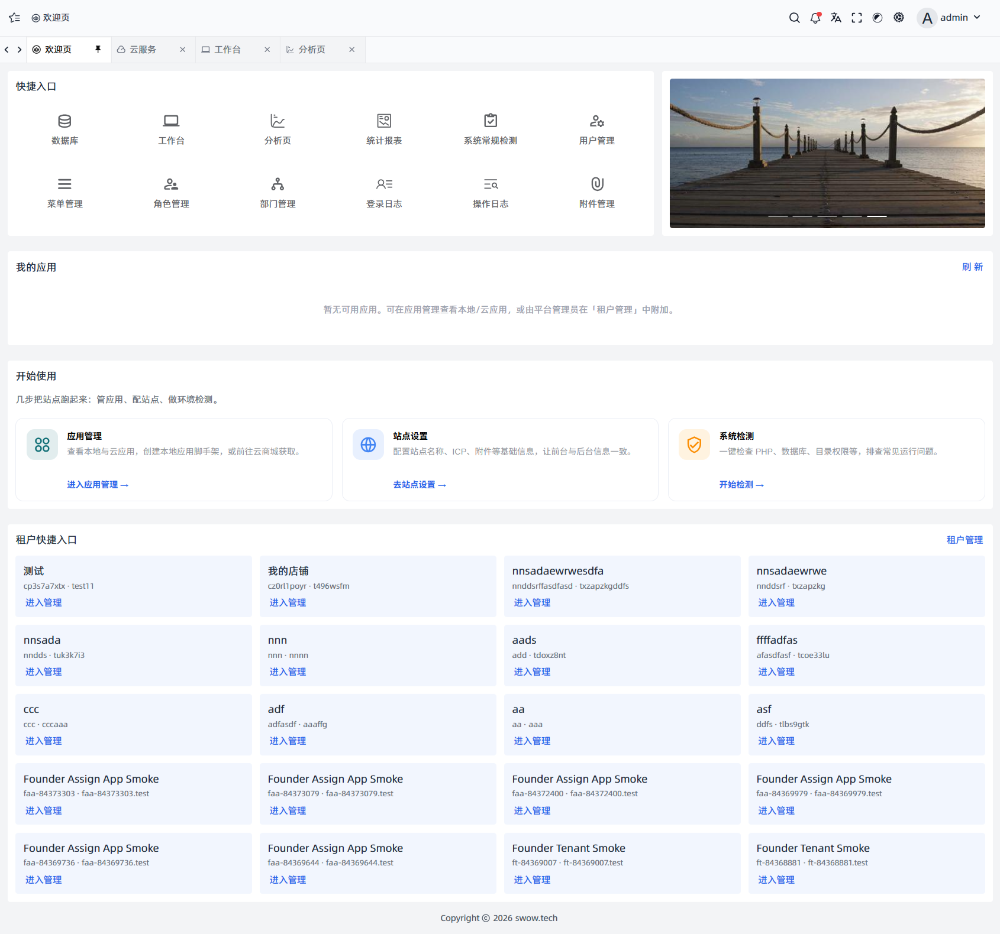
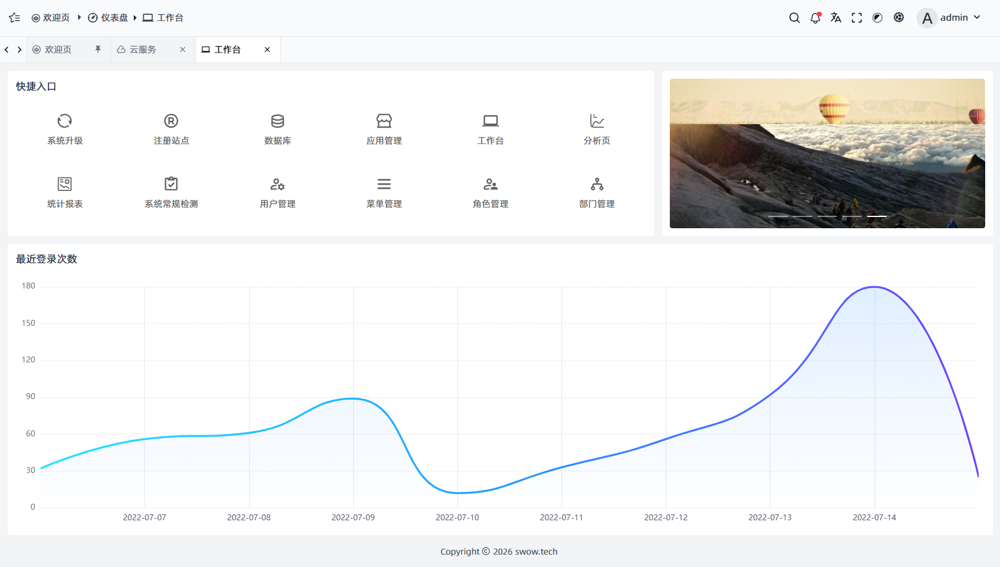
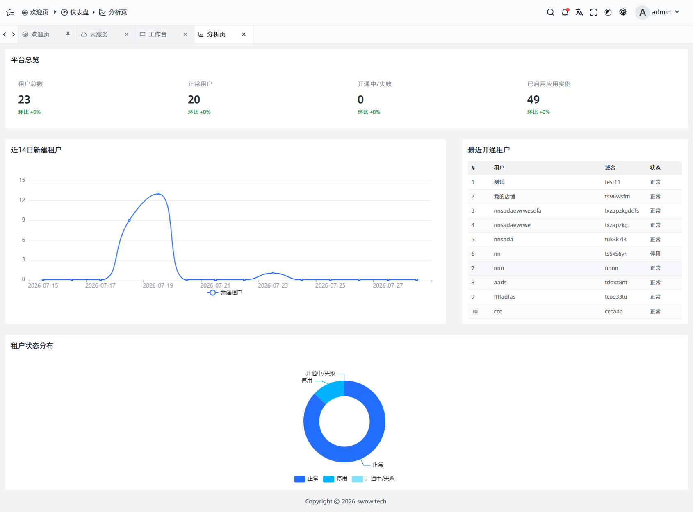
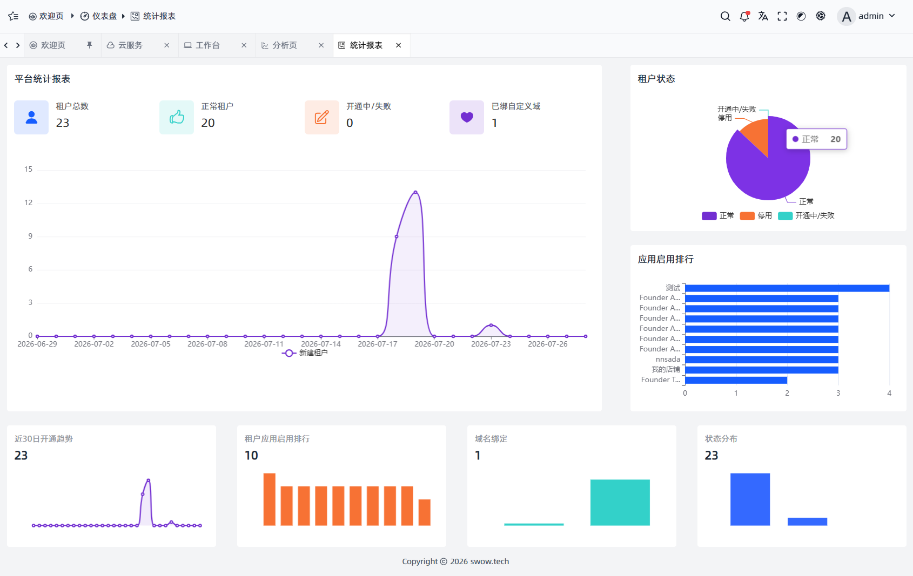
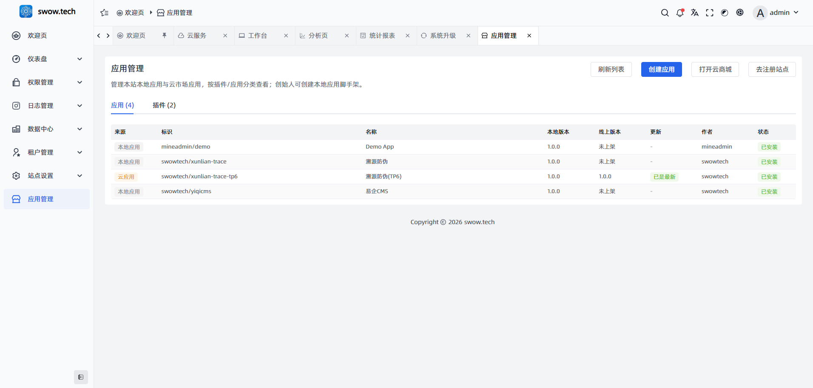
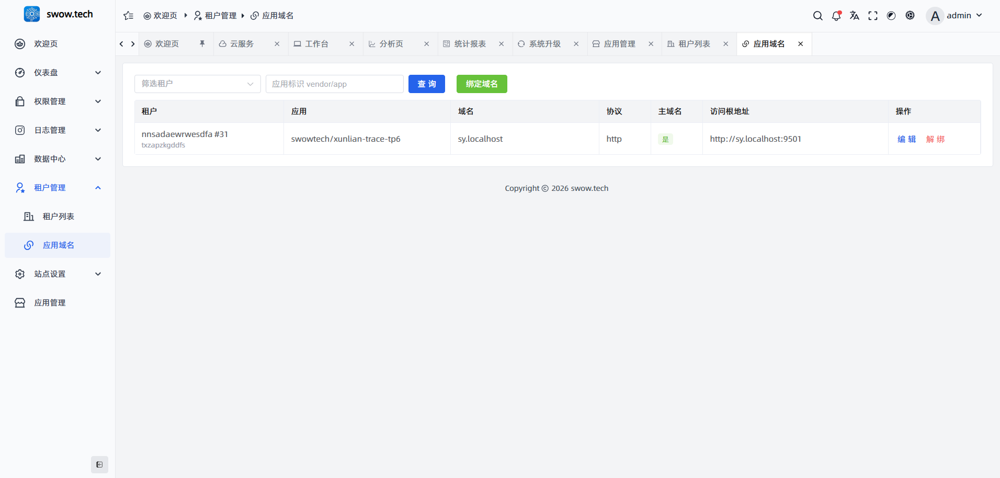
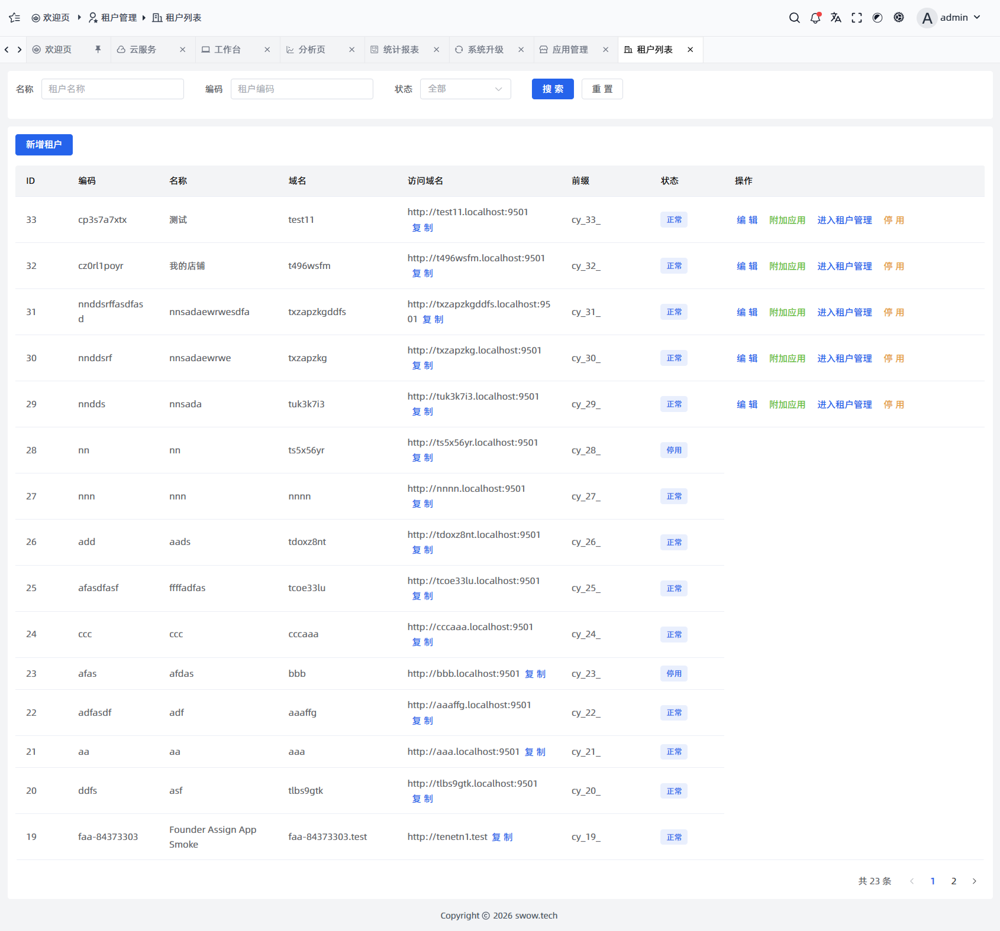

# swow.tech Tenant

[English](./README.md) | [中文](./README.zh-CN.md)

<p align="center">
  
</p>

Open-source **tenant site** stack for [swow.tech](https://swow.tech).

| Directory | Role | Default port |
|---|---|---|
| `tenant-php` | Tenant backend (Hyperf + Swow) | **9501** |
| `tenant-vue` | Tenant admin UI | **2888** |

> Renamed from the historical `user-php` / `user-vue` layout.

## Architecture (overview)



## Requirements

- PHP ≥ 8.1 (Swow recommended)
- MySQL ≥ 5.7 (8.0 recommended)
- Redis (recommended)
- Node.js ≥ 18

## Quick start

### Backend

```bash
cd tenant-php
cp .env.example .env
# edit DB / APP_URL / SERVER_PORT
composer install
php bin/hyperf.php start
```

### Frontend

```bash
cd tenant-vue
npm install
npm run dev
```

Open the URL printed by Vite (commonly `http://localhost:2888`).

## Screenshots

### Welcome



### Dashboard



### Analysis / Reports





### App management / App domains





### Tenants (founder)



## Repository

- GitHub: https://github.com/SwowTech/tenant
- Docs site: [swow.tech](https://swow.tech)

## License

See `LICENSE` files under each package when present.
