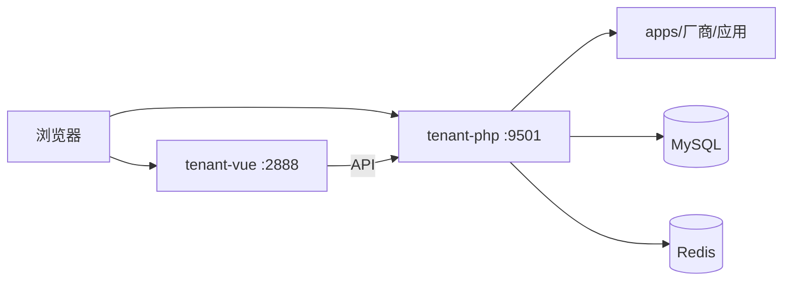

# swow.tech Tenant（租户站点）

[English](./README.md) | [中文](./README.zh-CN.md)

<p align="center">
  
</p>

[swow.tech](https://swow.tech) 开源 **租户站点** 栈：后台 + 管理端，支持租户隔离与独立应用网关。

| 目录 | 作用 | 默认端口 |
|---|---|---|
| `tenant-php` | 租户后端（Hyperf + Swow） | **9501** |
| `tenant-vue` | 租户管理端 | **2888** |

> 由历史目录名 `user-php` / `user-vue` 更名而来。

## 架构一览



## 环境要求

- PHP ≥ 8.1（推荐 Swow）
- MySQL ≥ 5.7（推荐 8.0）
- Redis（推荐）
- Node.js ≥ 18

## 快速开始

### 后端

```bash
cd tenant-php
cp .env.example .env
# 配置数据库、APP_URL、SERVER_PORT 等
composer install
php bin/hyperf.php start
```

### 前端

```bash
cd tenant-vue
npm install
npm run dev
```

打开 Vite 打印的地址（常见为 `http://localhost:2888`）。

本地租户示例：`http://{租户标识}.localhost:2888/login`。

## 界面截图

### 欢迎页


### 工作台


### 分析页 / 统计报表


### 应用管理 / 应用域名


### 租户列表（创始人）


> 继续补充截图：把 PNG 放进 `docs/images/`，在本文件用 `` 引用后推送即可。

## 仓库与文档

- GitHub：https://github.com/SwowTech/tenant
- 产品文档：[swow.tech](https://swow.tech)

## 许可证

各子目录下如有 `LICENSE` 文件，以其为准。
